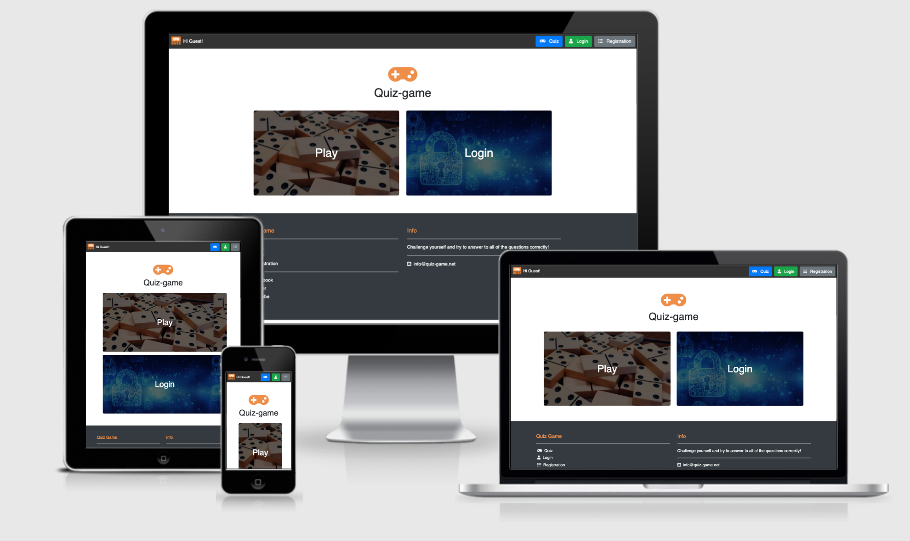
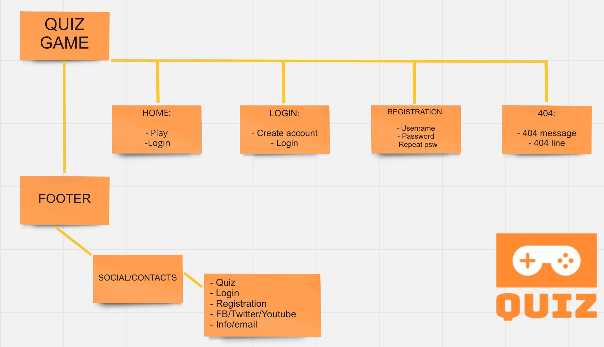
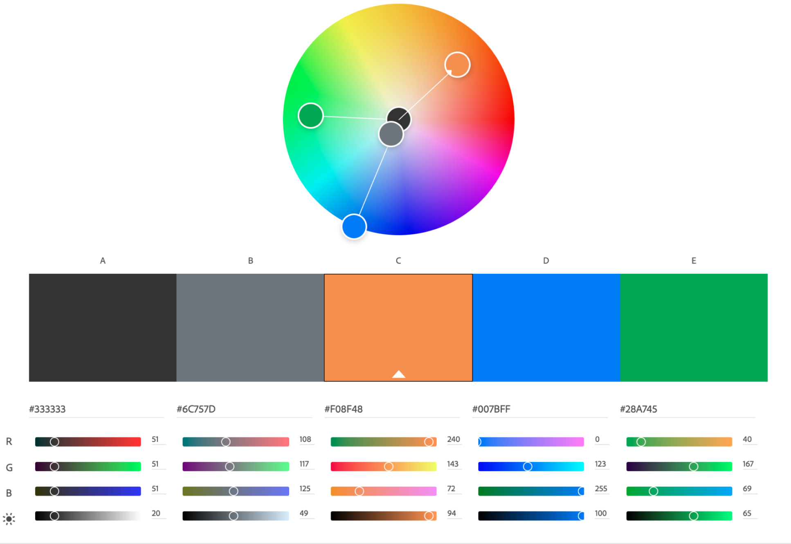
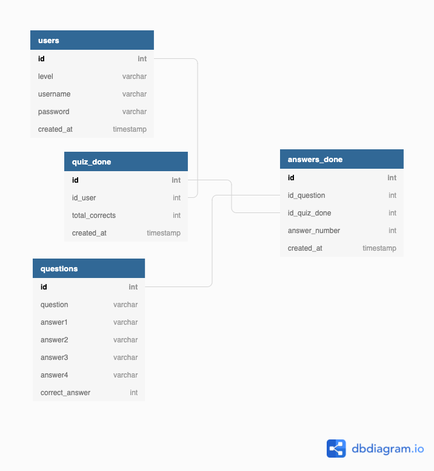
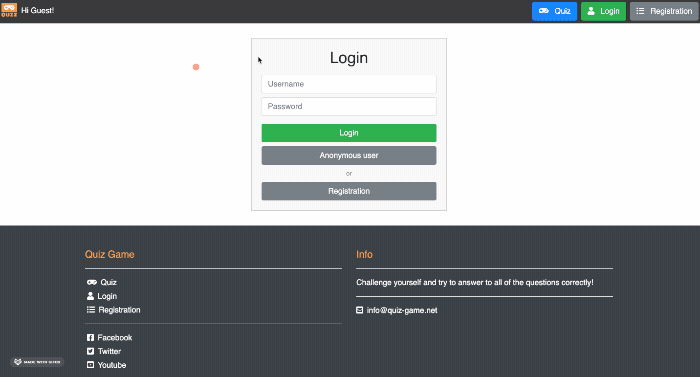
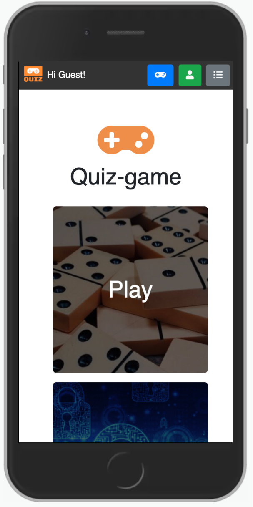
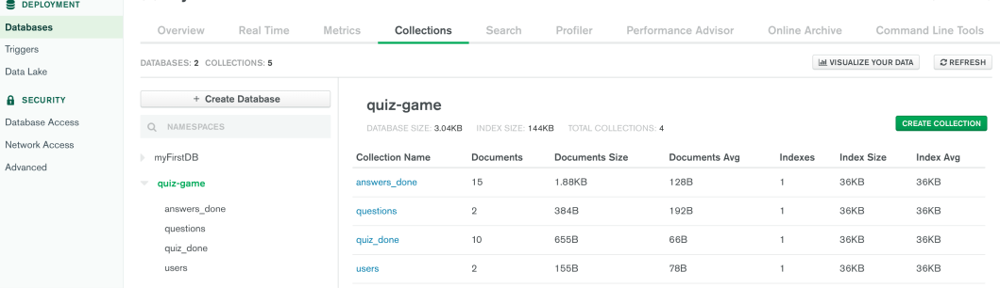
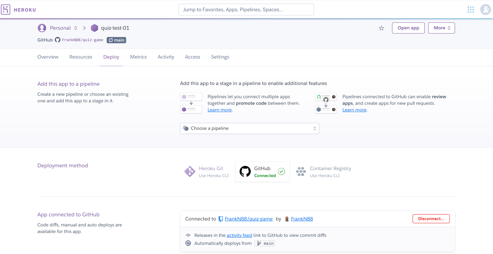
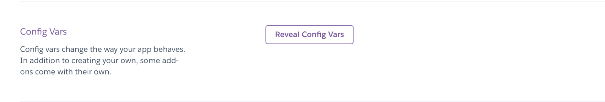
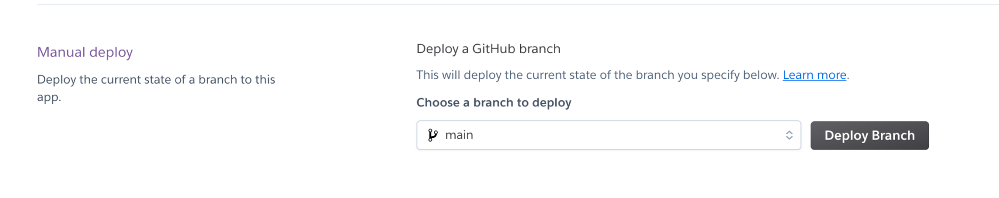

<h1 align="center">The Quiz Game :game_die: | Milestone :three: Project </h1>

### [View live project here](https://quiz-test-01.herokuapp.com/)
### [View the testing information here - (TESTING.md) ](TESTING.md)

## Overview

This website is aimed for people who want to play a quizgame as a diversion during their chilling time.
The website is designed to be responsive and accessible on all devices being at the same time simple but pleasant.

---

## Table of Contents

1. [UX](#ux)
- [User Stories](#user-stories)
- [User Centered Design](#user-centered-design)
  - [Strategy](#strategy)
    - [User needs](#user-needs)
  - [Scope](#scope)
  - [Structure](#structure)
  - [Skeleton](#Skeleton)

2. [DESIGN](#design)
- [Color scheme](#color-scheme)
- [Typography](#typography)
- [Imagery](#imagery)
- [Logo](#logo)

3. [DATABASE MODEL](#database-model)
- [Database model features](#database-model-features)

4. [FEATURES](#features)
- [Design Features](#design-features)
- [Features left to implement](#features-left-to-implement)

5. [TECHNOLOGIES USED](#technologies-used)
- [Syntax](#syntax)
- [Frameworks, Libraries & Programs](#frameworks-libraries-&-programs)

6. [TESTING](#testing)
- [Testing document](TESTING.md)

7. [DEPLOYMENT](#deployment)
- [Mongo Database](mongo-database)
- [Heroku](#heroku)
- [Github](#github)
  - [Deploying on GitHub Pages](#deploying-on-gitHub-pages)
  - [Forking the repository](#forking-the-repository)
  - [Creating a Clone](#creating-a-clone)

8. [CREDITS](#credits)

9. [REFERENCES](#references)

10. [ACKNOWLEDGEMENTS](#acknowledgements)

## UX

### **User stories**

 #### As an anonymous user/ first time visitor I want to:
  1. Be able to easily navigate throughout the site to find content and contacts.
  2. Play the quiz game.
  3. Get my feedback regarding the score.
  4. Locate their social media links to see their followings on social media in order to be updated about their latest releases.

 #### As a registered user/ returning/ frequent visitor I want to:
  5. Be able to manage my own posts by editing and/or deleting them.
  6. Be able to play the game and navigate through the pages.
  7. Not to be allowed to remove any other scores except mine.
  8. Check out my previous scores and therefore my progress.
  9. Find the best way to get in contact with the organisation with any question I may have.
  10. Find the social media links so that I can join and interact with others in the community.

 #### As the admin I want to:
  11. Be able to delete any users scores.
  12. Be able to edit any users scores.
  13. Have unique access to all features.

  #### As the website owner I want to:
  14. Increase the number of people playing the games therefore the popularity of the website.
  15. Be in touch with the users.
  16. Make the website as accessible and responsive as possible..
  17. Gain a better understanding of the audience by checking their feedback both via the social networks.
  18. Use reviews to increase customer satisfaction.

---

## USER CENTERED DESIGN

### **Strategy**

- #### User needs

The main goal of this website is to convert visitors into active users so that the website can get as popular as possible.
All users will be able to play the game. 
Registered users will be able to see their previous scores and their progress in the game.
The website will show a bright palette as well as minimalistic but aesthetically pleasing imagery to invite users to play.

- **Demographic:**
  - Anyone who wants to play a game online.
  - No specific age or background.
  - Whoever is interested in a culture quiz.

The steps a new user would ideally take when landing onto the website are the following:
  - Explore the websites landing page, where the information will explain the user the reason to be of the site.
  - Create a new account.
  - Explore the additional features available to registered users.
  - Play their game and see the results posted on the main page.
  - Log in/out to check the progress.
  - Check out the links in the footer for feedbacks.

The website needs to enable the **User** to:
  - Easy access the features of the website.
  - Register and log in if further interested.
  - Get in touch with the website owner and/or admin.
  - Give feedback.

The website needs to enable the **Website owner and/or admin** to:
  - Develop an online presence .
  - Provide an easily navigable website for users.
  - Improve the website thanks to the contacts.
  - Use this website as a starting point for a bigger project.

This will all be achieved through creating a clear and strong UI focusing on well structured content. Having a clear hierarchy will allow the user to navigate and use the functionality of the website without the need of instructions. Simplicity and UX friendly functionality will be the strongholds of the whole project. 

---

### **Scope**

- **Features within the design plan with highest priority:**
  - Minimal but functional and appealing homepage .
  - Navigation links clearly visible on the top of the website.
  - Responsive navigation bar.
  - Only allow registered users to create and manage their own account.
  - Only allow registered users to check out their previous scores.

- **Lower priority features that may not be included in the initial release of the website:**
  - The ability for logged in users to search the websites database.
  - Search bar on the navigation bar so the users have fast access to their scores.
  - Contact section to send an email to the Admin directly from the website.

---

### Structure

The information architecture was organized in a fluid and clear way in order to ensure that users could navigate through the site with ease and efficiency.

---

### Skeleton 
Wireframe mockups were created in Figma Workspace [Click here for final wireframes](docs/wireframes).
Several style changes were made in the final project compared to the inital wireframe on Figma. Those changes were mainly related to colours, font size, positioning on the page; all aimed at providing the best user experience and responsiveness.

---

## DESIGN

The design of the website was created to be as simple and harmonious as possible, not to distract the user with too many color schemes and trying to bring the focus onto the game itself.

### **Color scheme**

The colours used in this project are presented on a light background, to keep a minimalistic and tidy website, as well as keeping the color contrast the highest possible to facilitate the screen readers and make this site accessible to all. In addition to that there are also some brighter features thought specifically to draw the attention of the user to the main parts.
 
Please check out the colour Colour palette.
 

Colour palette

    
 

---

### **Typography**

- The selected font for the whole project is [Helvetica](https://en.wikipedia.org/wiki/Helvetica)

---

### **Imagery**

- For this specific project imagery has been kept very minimalist in order to concentrate the work on the functionality of the app. Images have been selected from [Unsplash](https://unsplash.com/ "Link to Unsplash page").

---

### **Logo**

- The favicon was created using [Favicon.io](https://favicon.io/favicon-converter/) and the logo used to create it was created using an online application called [Freelogodesign](https://it.freelogodesign.org/). It represents a simple joystick with the "Quiz" word under.
 

Logo

    
 

---

## Database Model

### Database model features

- The website is a data-centric one with html, javascript, css used with the bootstrap framework as a frontend.
- The backend consists of Python, flask and jinja templates with a database of a mongodb open-source document-oriented database.

- This model contains all fields stored in the database collections with their data type and mimics the structure of what is actually stored in the mongo database(mongodb). [DbDiagram.io](https://dbdiagram.io/home) has been used for this purpose.

---

## Features

### Design Features
Each page of the website features a consistent responsive navigational system:

 

#### Header
- The **Header** contains a conventionally placed **logo** at the top left of the page (clicking this will redirect users back to the home page) and **navigation bar** at the top right of the page.
<ul>
    <li><strong>User stories covered by this feature:</strong>  
    </li>
    <li><strong>1</strong> - Be able to easily navigate throughout the site to find content and contacts.
    </li>
    <li><strong>2</strong> - Play the quiz game.
    </li>
    <li><strong>16</strong> - Make the website as accessible and responsive as possible.
    </li>
</ul>
  

Header

    
  

 

#### Navigation bar on smaller devices
- On smaller screens, the two main buttons (Play and Login) reduce their size in a responsive way and self position at the top right next to the registration one.
<ul>
    <li><strong>User stories covered by this feature:</strong>  
    </li>
    <li><strong>1</strong> - Be able to easily navigate throughout the site to find content and contacts.
    </li>
    <li><strong>6</strong> - Be able to play the game and navigate through the pages.
    </li>
    <li><strong>16</strong> - Make the website as accessible and responsive as possible..
    </li>
</ul>
  

Navbar on small devices

    
  

 

#### Footer
- The **Footer** contains the appropriate **social media icons**, linking users to the main social media pages of the Quiz Game.
<ul>
    <li><strong>User stories covered by this feature:</strong>  
    </li>
    <li><strong>x</strong> - x
    </li>
    <li><strong>x</strong> - x
    </li>
    <li><strong>x</strong> - x
    </li>
    <li><strong>x</strong> - x
    </li>
</ul>
  

Footer

    
  

 

#### Mailto/Callto
- In the footer, there are respectively a **Mailto** and a **Callto** embedded in the email and number.
<ul>
    <li><strong>User stories covered by this feature:</strong>  
    </li>
    <li><strong>x</strong> - x
    </li>
    <li><strong>x</strong> - x
    </li>
    <li><strong>x</strong> - x
    </li>
    <li><strong>x</strong> - x
    </li>
    <li><strong>x</strong> - x
    </li>
</ul>
  

Mailto/Callto

    
  

 

#### Back to the top button
- **Back to the top button**  - Those <strong>buttons</strong> :arrow_up: are present in the footer so that the user can comfortably click them to be redirected to the top of the page. This feature improves the quality of navigation, especially if using smartphones.
<ul>
    <li><strong>User stories covered by this feature:</strong>  
    </li>
    <li><strong>x</strong> - x
    </li>
    <li><strong>x</strong> - x
    </li>
</ul>
  

Btn back to the top

    
  

 

<dl>
  <dt><a href="index.html" target="_blank" alt="Quiz game Home Page">Home Page</a></dt>
     <ul>
         <li><strong>User stories covered by this feature:</strong>  
      </li>
          <li><strong>x</strong> - x
      </li>
          <li><strong>x</strong> - x
      </li>
          <li><strong>x</strong> - x
      </li>
          <li><strong>x</strong> - x
      </li>
     </ul>
  <dd>The Home Page consists of the following elements:
     <ul>
          <li><strong>x</strong> - x
          </li>
          <li><strong>x</strong> - x
          </li>
          <li><strong>x</strong> - x
          </li>
          <li><strong>x</strong> - x
          </li>
     </ul>
        

Home

        
        

  </dd>

   

  <dt><a href="x.html" target="_blank" alt="x Page">x</a></dt>
     <ul>
         <li><strong>User stories covered by this feature:</strong>  
      </li>
          <li><strong>x</strong> - x
      </li>
          <li><strong>x</strong> - x
      </li>
          <li><strong>x</strong> - x
      </li>
          <li><strong>x</strong> - x
      </li>
          <li><strong>x</strong> - x
      </li>
     </ul>
  <dd>The x page consists of the following elements:
     <ul>
          <li><strong>x</strong> - x
          </li>
          <li><strong>x</strong> - x
          </li>
          <li><strong>x</strong> - x
          </li>
     </ul>
         

x

         
         

  </dd>

   

  <dt><a href="x.html" target="_blank" alt="x Page">x Page</a></dt>
     <ul>
         <li><strong>User stories covered by this feature:</strong>  
      </li>
          <li><strong>x</strong> - x
      </li>
          <li><strong>x</strong> - x
      </li>
          <li><strong>x</strong> - x
      </li>
          <li><strong>x</strong> - x
      </li>
          <li><strong>x</strong> - x
      </li>
     </ul>
  <dd>The projects page consists of the following elements:
     <ul>
          <li><strong>x</strong> - x
          </li>
          <li><strong>x</strong> - x
          </li>
          <li><strong>x</strong> - x
          </li>
          <li><strong>x</strong> - x
          </li>
     </ul>
         

x

         
         

  </dd>

   

  <dt><a href="404.html" target="_blank" alt="404 Page">404 Page</a></dt>
     <ul>
         <li><strong>User stories covered by this feature:</strong>  
      </li>
          <li><strong>x</strong> - x
      </li>
          <li><strong>x</strong> - x
      </li>
     </ul>
  <dd>The 404 page consists of the following elements:
     <ul>
          <li><strong>Navbar</strong> - Occupies 100% of the page width, from the left to the right, while being viewed on all devices. It Includes the standard links to the other pages.
          </li>
          <li><strong>Title</strong> - It shows that the user is on page 404.
          </li>
          <li><strong>Title 2</strong> - Standard line for a page 404, inviting the user to click on the links to go back to a page of the website.
          </li>
          <li><strong>Footer</strong> - Standard footer with the links as in the other pages.
          </li>
     </ul>
         

404

         
         

  </dd>
  </dl>

   

### Features left to implement

- The option for users to personalize their profile with images.
- The option for users to delete their account from the database.
- The option to have a few super users.
- A contact form built in to submit requests.
- A personalized message to each user is displayed on log in.
- The user will be able to choose among many subjects (maths, history, physics, chemistry etc) based on his/her inclination.
- When logged in, the user will be redirected to their profile page with his personalised settings.

---

## TECHNOLOGIES USED

### **Syntax**

- [HTML5](https://en.wikipedia.org/wiki/HTML5)
- [CSS](https://en.wikipedia.org/wiki/CSS)
- [Markdown](https://www.markdownguide.org/basic-syntax/)
- [JavaScript](https://en.wikipedia.org/wiki/JavaScript)
- [JQuery](https://jquery.com/)
- [Python](https://en.wikipedia.org/wiki/Python_(programming_language))

---

### Frameworks, Libraries & Programs

- [Figma:](https://www.figma.com/login)
  - Figma was used to create the [wireframes](put link to wireframes) during the design process.

- [Font Awesome](https://fontawesome.com/)
  - Used to include icons.

- [Google Fonts](https://fonts.google.com/)
  - Used to import the three fonts used throughout the site xxxxxxxx.

- [GitHub](https://github.com/)
  - Used to host the entire repository for the project.

- [GitPod](https://www.gitpod.io/)
  - The code editor used to build the entire project.

- [TinyPNG](https://tinypng.com/)
  - Used this to compress the images used on the website to make files smaller.

- [Favicon](https://favicon.io/)
  - Used to generate the websites favicon logo of various sizes for different devices.

- [W3C Validator HTML](https://validator.w3.org/)
  - Validator for HTML.

- [W3C Validator CSS](https://jigsaw.w3.org/css-validator/)
  - Validator for CSS.

- [JSHint](https://jshint.com/)
  - This is a tool used to detect errors or potential problems within Javascript code, used to test and validate all Javascript written for this project.

- [Pylint](https://www.pylint.org/)
  - Pylint is a source-code, bug and quality checker for the Python programming language.

- [PyMongo](https://pymongo.readthedocs.io/en/stable/)
  - PyMongo is the official MongoDB Python driver for MongoDB.

- [Flask](https://flask.palletsprojects.com/en/2.0.x/)
  - Flask is a micro web framework written in Python. It is classified as a microframework because it does not require particular tools or libraries.
  - Flask requires the [Jinja](https://jinja.palletsprojects.com/en/3.0.x/) template to work.

- [Flask PyMongo](https://flask-pymongo.readthedocs.io/en/latest/)
  - Flask-PyMongo bridges Flask and PyMongo and provides some convenience helpers.

- [Heroku](https://id.heroku.com/login)
  - Heroku is a cloud platform as a service (PaaS) supporting several programming languages.
  - The Heroku network runs the customer's apps in virtual containers which execute on a reliable runtime environment.

- [BrowserStack](https://www.browserstack.com/)
  - Test the functionality and appearance of the project on all main browsers.

- [Jinja](https://jinja.palletsprojects.com/en/3.0.x/)
  - Jinja is a web template engine for the Python programming language. It allows writing code similar to Python syntax. Then the template is passed data to render the final document.
  - Jinja templating is built into the [Flask](https://flask.palletsprojects.com/en/2.0.x/) library.

- [W3Schools](https://www.w3schools.com/)
  - To check demos and explanations.

- [Stack overflow](https://stackoverflow.com/)
  - To find answers to most common problems.

---

## Testing
Testing information can be found in a separate testing :information_source: [file](TESTING.md "Link to testing file")

---

## Deployment

### Mongo Database
Mongodb is the database used in the application:

1. Create an account at mongodb.
2. Create a database cluster.
3. Select the cluster, and in the collections section create a database and create the necessary collections under the database:

4. In the database access, create a user and allow the user read/write access.
5. In the network access tab, allow network access from the ip-address of the application connecting to the database.
6. In the Databases section click Connect, and select connect your application.
7. Note the MONGO_URI, MONGO_DBNAME and user, these parameters are used when deploying locally(env.py file) and deploying on the likes of heroku(config vars).

### Heroku

To deploy this application to Heroku, run the following steps.
1. In the app.py file, ensure that debug is not enabled, i.e. set to True.
2. Create a file called ProcFile in the root directory, and add the line <code>web: python app.py</code> if the file does not already exist.
3. Create a requirements.txt file by running the command <code>pip freeze > requirements.txt</code> in your terminal if the file doesn't already exist.
5. Both the ProcFile and requirements.txt files should be added to your git repo in the root directory.
6. Create an account on heroku.com.
7. Create a new application and give it a unique name.
8. In the application dashboard, navigate to the deploy section and connect your application to your git repo, by selecting your repo.

9. Select the branch for example master and enable automatic deploys if desired. Otherwise, a deployment will be manual.
10. The next step is to set the config variables in the Settings section.

11. Set key/value pairs for the following keys: AWS_ACCESS_KEY_ID, AWS_SECRET_ACCESS_KEY, IP, MONGO_DBNAME, MONGO_URI, PORT, SECRET_KEY.
12. Go to the dashboard and trigger a deployment.

13. This will trigger a deployment, once the deployment has been successful click on the "Open App" link to open the app.
14. If you encounter any issues accessing the build logs is a good way to troubleshoot the issue.

### Github

#### Deploying on GitHub Pages
To deploy this page to GitHub Pages from its GitHub repository, the following steps were taken:
1. Log into [GitHub](https://github.com/login "Link to GitHub login page") or [create an account](https://github.com/join "Link to GitHub create account page").
2. Locate the [GitHub Repository](https://github.com/FrankN88/xxxxxxxx "Link to GitHub Repo").
3. At the top of the repository, select Settings from the menu items.
4. Scroll down the Settings page to the "GitHub Pages" section.
5. Under "Source" click the drop-down menu labelled "None" and select "Master Branch".
6. Upon selection, the page will automatically refresh meaning that the website is now deployed.
7. Scroll back down to the "GitHub Pages" section to retrieve the deployed link.
8. At the time of submitting this Milestone project, the Development Branch and Master Branch are identical.

#### Forking the Repository
By forking the GitHub Repository a copy of the original repository is made on the GitHub account. To view and/or to make  changes without affecting the original repository: 
1. Log into [GitHub](https://github.com/login "Link to GitHub login page") or [create an account](https://github.com/join "Link to GitHub create account page").
2. Locate the [GitHub Repository](https://github.com/FrankN88/xxxxxxxxxxx "Link to GitHub Repo").
3. At the top of the repository, on the right side of the page, select "Fork".
4. You should now have a copy of the original repository in your GitHub account.

#### Creating a Clone
How to run this project locally:
1. Install the [GitPod Browser](https://www.gitpod.io/docs/browser-extension/ "Link to Gitpod Browser extension download") Extension for Chrome.
2. After installation, restart the browser.
3. Log into [GitHub](https://github.com/login/ "Link to GitHub login page") or [create an account](https://github.com/join "Link to GitHub create account page").
4. Locate the [GitHub Repository](https://github.com/FrankN88/FrankN88/xxxxxxx "Link to GitHub Repo").
5. Click the green "GitPod" button in the top right corner of the repository.
This will trigger a new gitPod workspace to be created from the code in github where you can work locally. 
Click [Here](https://help.github.com/en/github/creating-cloning-and-archiving-repositories/cloning-a-repository#cloning-a-repository-to-github-desktop) to retrieve pictures for some of the buttons and more detailed explanations of the above process

---

## CREDITS

### Content
- Stack Overflow for guidance
- Psychological properties of text colour in the README.md was found [here](http://www.colour-affects.co.uk/psychological-properties-of-colours)
- [Bootstrap](https://getbootstrap.com/ "Link to BootStrap page") for the Boostrap features.

### Media
- Some Images come from my personal archives
- All the other Images were downloaded from [Unsplash](https://unsplash.com/ "Link to Unsplash page").

### Code
The developer consulted multiple sites in order to better understand the code that they were trying to implement. The following sites were used on a more regular basis:
- [Stack Overflow](https://stackoverflow.com/ "Link to Stack Overflow page")
- [W3Schools](https://www.w3schools.com/ "Link to W3Schools page")
- [Bootstrap](https://getbootstrap.com/ "Link to BootStrap page")
- [MDN Web Docs](https://developer.mozilla.org/en-US/ "Link to MDN Web Docs")
- [jQuery](https://jquery.com/ "Link to jQuery page")
- [Flask](https://flask.palletsprojects.com/en/2.0.x/ "Link to Flask page")
- [Python](https://www.python.org/ "Link to Python page")
- [MongoDB](https://docs.mongodb.com/ "Link to MongoDB Docs")

### Acknowledgements
- My mentor Mo Shami for continuous helpful feedback.
- Tutor support at Code Institute for their support.
- My family for opinions and feedback.

***

---

