<h1 align="center">The Quiz Game :game_die: | Milestone :three: Project </h1>

### [View live project here](https://quiz-test-01.herokuapp.com/) ###

### [Main README.md file](/README.md) ###

### Testing User Stories from User Experience (UX) Section

-   #### Anonymous user/ First time visitor Goals:

    1. Be able to easily navigate throughout the site to find content and contacts.

        1. Upon entering the site, users are automatically greeted with a clean and easily readable sticky navigation bar to go to the page of their choice.
           

Evidence

           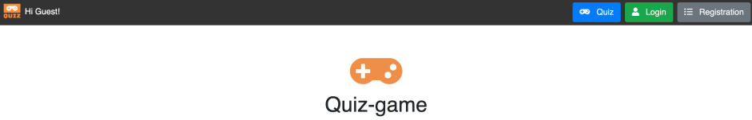
           

        2. The main features are immediately shown with two cards in the middle of the page.
           

Evidence

           
           

        3. At the bottom of the page there is a footer with the links to the social networks and contacts. 
           

Evidence

           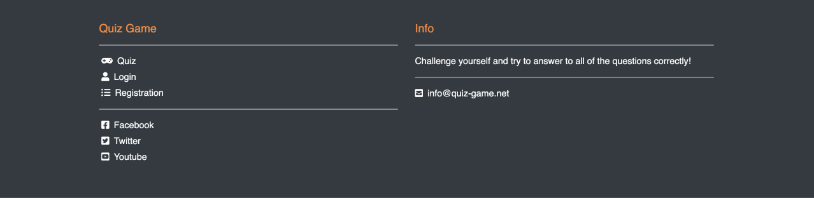
           

    2. Play the quiz game.

        1. One card (Play) allows the user to play immediately the quiz game. 
           

Evidence

           
           

        2. The other card allows the user to login.
           

Evidence

           
           

    3. Get my feedback regarding the score.

        1. The anonymous user will get the score immediately after the game whilst the registered user will be able to see more data and details regarding the current score and previous ones.
           

Evidence

           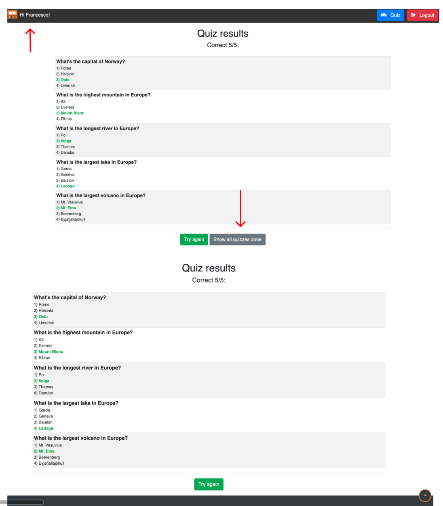
           

    4. Locate their social media links to see their followings on social media in order to be updated about their latest releases.

        1. The social media links are located in the footer together with contact.
           

Evidence

           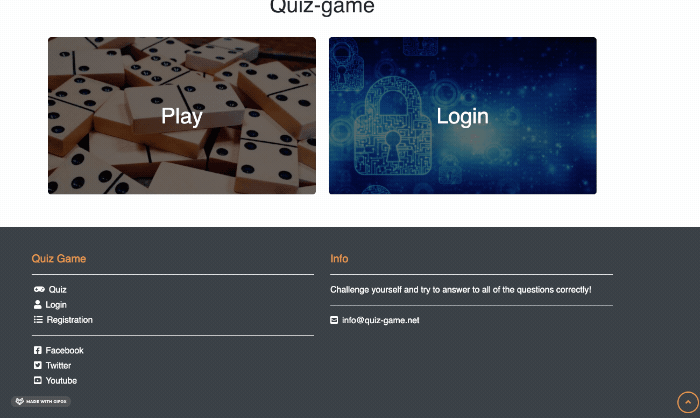
           

-   #### Registered user/ returning/ frequent visitor goals

    5. Be able to visualise my own posts.

        1. The registered user is able to see the history of the scores with exact dates.
           

Evidence

           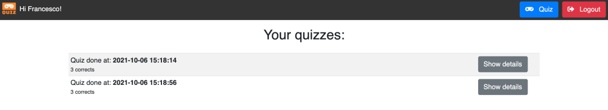
           

    6. Be able to play the game and navigate through the pages.

        1. The links/buttons are easy to spot and click.
           

Evidence

           
           

    7. Not to be allowed to remove any score (functionality only for admin).
        1. The logged in user can only visualise his/her score.
           

Evidence

           
           

    8. Check out my previous scores and therefore my progress.
        1. The registered user can visualise his/her previous scores.
           

           
           

    9. Find the best way to get in contact with the organisation with any question I may have.
        1. Link and contact in the footer.
           

Evidence

           
           

    
    10. Find the social media links so that I can join and interact with others in the community.
        1. Link and contact in the footer.
           

Evidence

           
           

       

-   #### Admin Goals

    11. be able to delete any users scores.

        1. The admin can delete any user | The admin will receive a warning message before deleting.
           

Evidence

           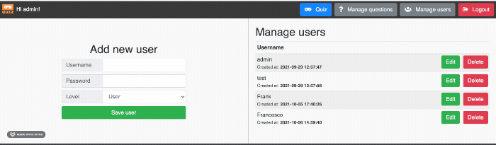
           

    12. be able to edit any question.

        1. The admin can edit any question.
           

Evidence

           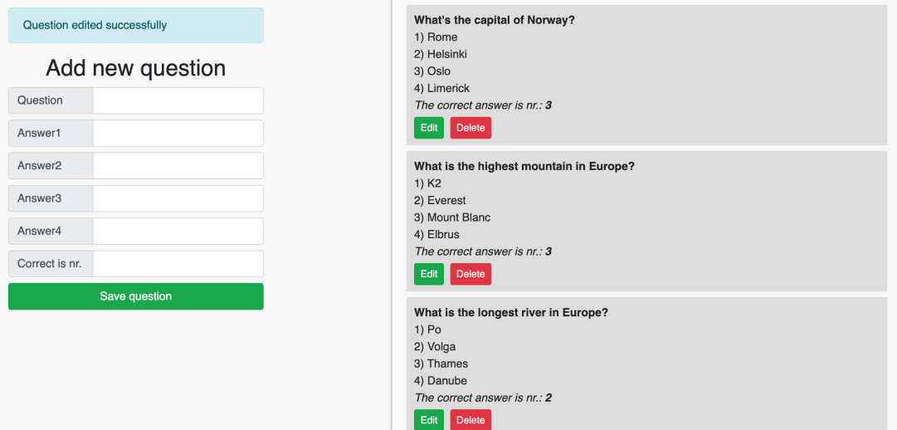
           

    13. have unique access to all features.

        1. The admin is the only one who can access all features.
           

Evidence

           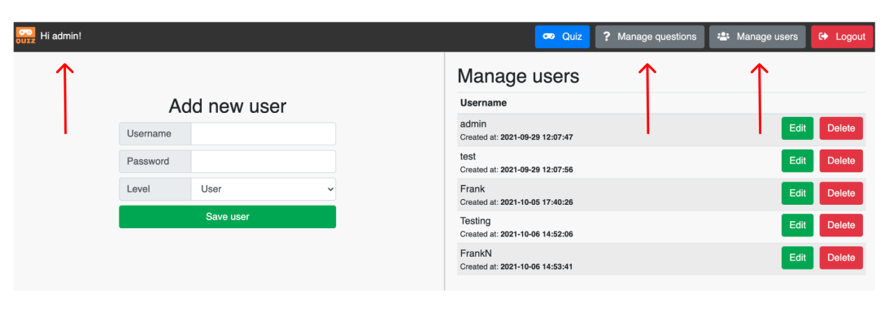
           

-   #### Site Owner Goals, Testing

     14. increase the number of people playing the games therefore the popularity of the website.

         1. Through the appealing design of the page.
           

Evidence

           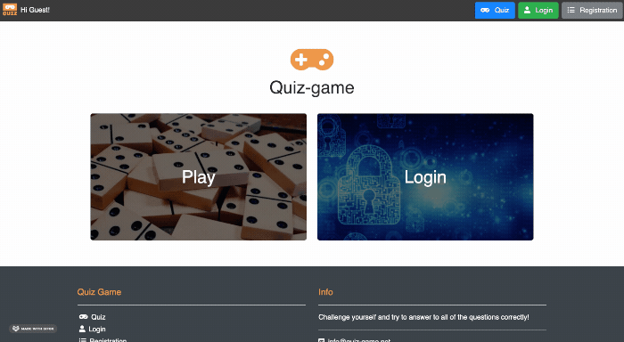
           

     15. be in touch with the users.

         1. Through the links in the footer and contact.
           

Evidence

           
           

     16. Make the website as accessible and responsive as possible.

         1. The website is responsive on any device and is designed according to the most important UX principles.
           

Evidence

           
           

     17. Gain a better understanding of the audience by checking their feedback both via the website and social networks.

         1. Possible via the reviews from ther social medias connected to the page.
           

Evidence

           
           

     18. Use reviews to increase customer satisfaction.

         1. Possible via regular updates (FB,Twitter,email) that connected to the social medias interactions give the owner a trend of its audience.
           

Evidence

           
           

## User testing 
Friends and family members were asked to review the site and documentation to point out any feedback and possible way of improving it. Their helpful advice throughout the process led to many UX changes in order to create a better experience, especially regarding the styling. 

It was through this testing that the following changes were made:
- Assessing the combinations of colours and the related contrast.
- Fonts choice looking smart and not invasive.
- Improving the overall images quality compared to the initial framework idea.
- Overall balance in the positioning and sizing of elements in the pages.

## Manual Testing  :wrench:

### Common Elements Testing
Manual testing was conducted on the following pages in order to assess responsiveness,functionality and usability:

- Hovering over the Navbar will trigger `hover` effect. The page the user is in it is clearly visible by the text decoration.
  

Navbar hover

    
  

- Hovering over Social links will trigger `hover` effect and clicking on them will open a new tab. 
  

Hover and open new tab

    
  

- Clicking on the logo will take you back to the home page or refresh it.
  

Click logo to return to home page

    
  

- Hovering over the email in the footer will trigger `hover` effect and clicking on them will redirect you to the email (mailto).
  

Mailto

    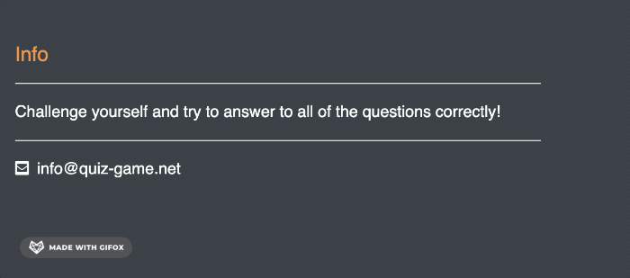
  

### Home Page
Manual testing was conducted on the following elements of the [Home Page](home.html):

 - All the elements are responsive (header, footer, cards).
 - The buttons in the Navbar turns into smaller buttons ordered in the same way.
   

Home Page

    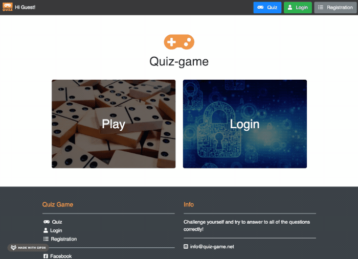
  

 
### Login Page
Manual testing was conducted on the following elements of the [Login Page](login.html):

 - All the elements are responsive (header, footer, central window).
 - The buttons in the Navbar turns into smaller buttons ordered in the same way.
   

Login page

    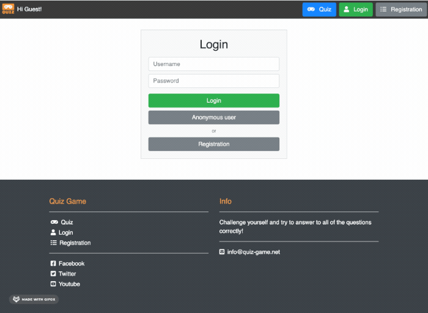
  

### Registration Page
Manual testing was conducted on the following elements of the [Registration Page](registration.html):

 - All the elements are responsive (header, footer, central window).
 - The buttons in the Navbar turns into smaller buttons ordered in the same way.
   

Registration page

    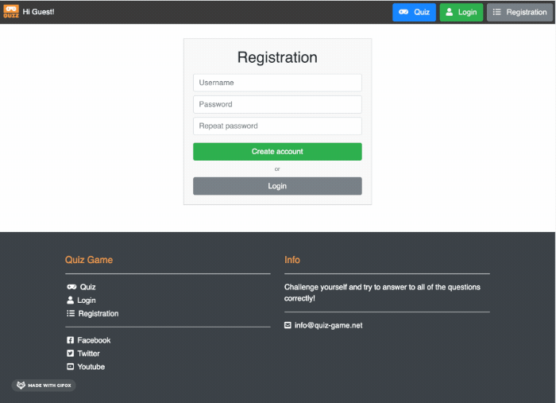
  

### 404 Page
Manual testing was conducted on the following elements of the [404 Page](404.html):

 - All the elements are responsive (header, footer, text).
 - The buttons in the Navbar turns into smaller buttons ordered in the same way.
   

404 Page

    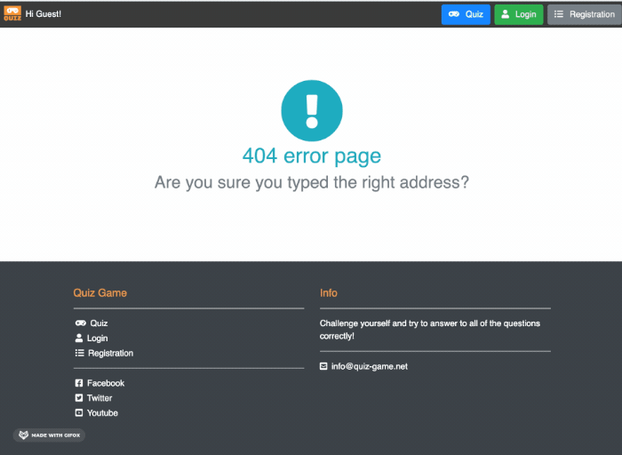
   

## Automated Testing  :wrench:

### Code Validation
- The [W3C Markup Validator](https://validator.w3.org/) service was used to validate the `HTML` code used.

Page | Result | Test Detail/Screenshot
------------ | ------------- | -------------
home.html | Passed, No errors found | [Results](docs/testing/validators/html_home_validation.png)
login.html | Passed, No errors found | [Results](docs/testing/validators/html_login_validation.png)
registration.html | Passed, No errors found | [Results](docs/testing/validators/html_registration_validation.png)
404.html | Passed, No errors found | [Results](docs/testing/validators/html_404_validation.png)

 

### CSS Validation Service
- The [W3C CSS Validator](https://jigsaw.w3.org/css-validator/) service was used to validate the `CSS` code used.

Page | Result | Test Detail/Screenshot
------------ | ------------- | -------------
style.css | Passed, No errors found | [Results](docs/testing/validators/css_validation.png)

 

### JSHint
- The [JS Hint](https://jshint.com/) service was used to validate the `JS` code used.

Page | Result | Test Detail/Screenshot
------------ | ------------- | -------------
script.js | 0 errors | [Results](docs/testing/validators/script_js.png)
admin.js | 0 errors | [Results](docs/testing/validators/admin_js.png)

 

### PYlint
- [PYlint](https://www.pylint.org/) was used to validate the `PYTHON` code used.

Page | Result | Test Detail/Screenshot
------------ | ------------- | -------------
app.py | 0 errors | [Results](docs/testing/validators/pylint_validation.png)

 

### PEP8 Online Check
- [PEP8 Online](http://pep8online.com/) was used to analyse the `PYTHON` file.

Page | Result | Test Detail/Screenshot
------------ | ------------- | -------------
app.py | 0 errors | [Results](docs/testing/validators/pep8_online.png)

 

### Browser Validation
- I have used [Lambda Test](https://www.lambdatest.com/) for cross-browser testing among the major browsers. 
- [Click here to check browser testing](docs/testing/browser_testing)

- **Microsoft Edge**: Website and user stories work as expected. 
- **Google Chrome**: Website and user stories work as expected. 
- **Safari**: Website and user stories work as expected.
- **Firefox**: Website and user stories work as expected. 

 

### Lighthouse Auditing
- I have used [Lighthouse](https://developers.google.com/web/tools/lighthouse) to test the performance, seo, best practices and accessability of the site

Page | Test Detail/Screenshot
------------ | -------------
home.html | [Results](docs/testing/validators/home_lighthouse.png)
login.html | [Results](docs/testing/validators/login_lighthouse.png)
registration.html | [Results](docs/testing/validators/registration_lighthouse.png)
404.html | [Results](docs/testing/validators/404_lighthouse.png)

 

### Bugs found during the testing phase

Bug no. | Bug description |  Bug fix |
------------ | ------------- | ------------- | 
1 | The biggest trouble i had was trying to work out why the app (successfully deployed) on Heroku would not launch| After several days of consulting the specific documentation i was suggested to go and check the settings. I neglected to add: PORT 5000 and IP 0.0.0.0
2 | Semicolons left in the app.py by mistake | They have been promptly removed as they were giving error warnings.
3 | The buttons in the navbar would be all disorganized in the mobile view | Problem solved withn CSS.
4 | External links would not open in another tab | Problem solved by adding target="_blank" attribute to the anchor tags.
5 | Field required | During the registration process even an empty form was accepted. I had to add "required" so that the user would not get a positive feedback for registration unless filling all of the necessary fields.
6 | User Cancellation | The Admin has the possibility to delete the registered user. Initially there was no warning when deleting a user. Now the admin will receive a warning message before proceeding.
7 | Footer out of place in Ipad view | At the end i have noticed that the footer of all the pages except the home page would not go down in the Tablet view. I have resolved that using the Flex property.
8 | The registered user could see his scores (current and old) only after playing | I have added a button in the header that connects to the scores part so that the user does not feel lost on the page.
9 | The app would crash if the user, playing the game, would click twice on any button of the game window | I have promptly corrected that error that i did not spot until the end.
10 | x | x

 

### CRUD Features (Creation, Reading, Updating and Deleting) evidence

 - <strong>Creation - </strong> The "Creation" function is present in two parts. The admin can create new questions in the "Manage Questions" section as well as creating new users in the "Manage Users" section.
   

Evidence

    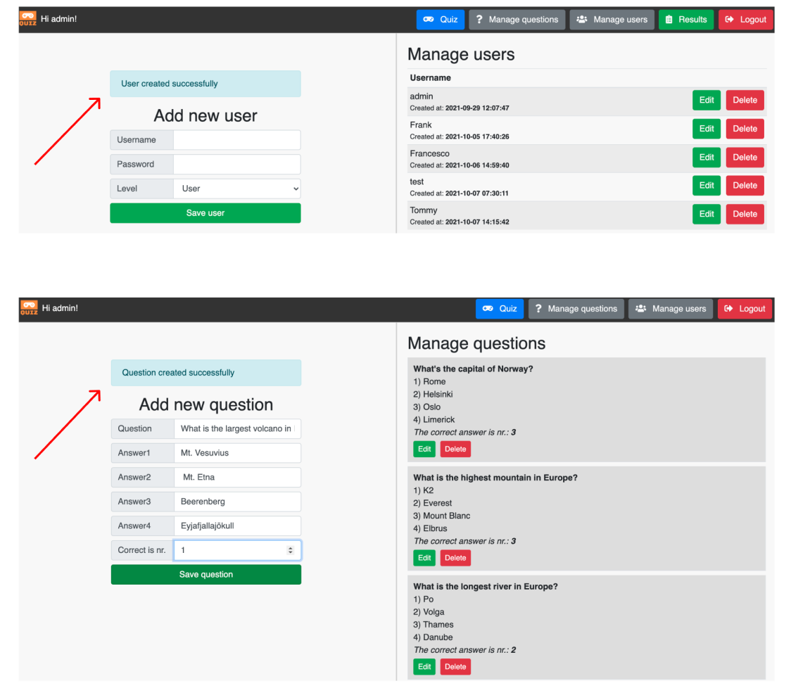
  

 - <strong>Reading - </strong> The admin can easily read any change that as been made as the application fives feedback after any action. The registered user can see his current scores, older scores and dates. The anonymous user can only see the feedback of the game.
   

Evidence

    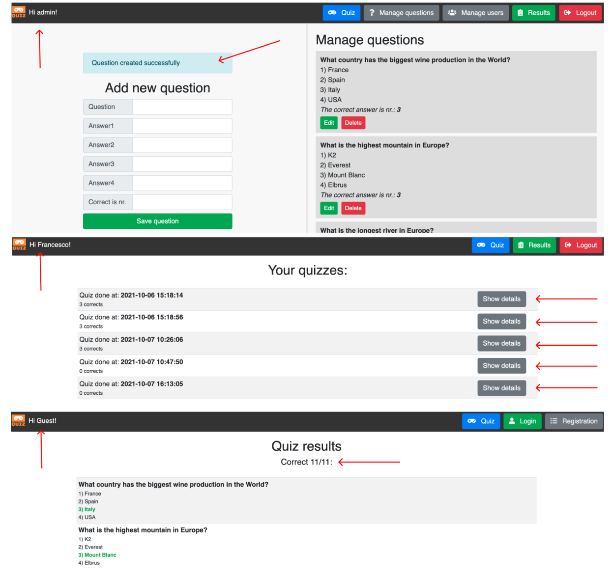
  

 - <strong>Updating - </strong> The "Updating" function is present in two parts. The admin can update current questions/answers and as well update the status of the user. A user can become admin if necessary or vice versa. This is a positive thing in case the admin needs more help with the maintenance of the website.
   

Evidence

    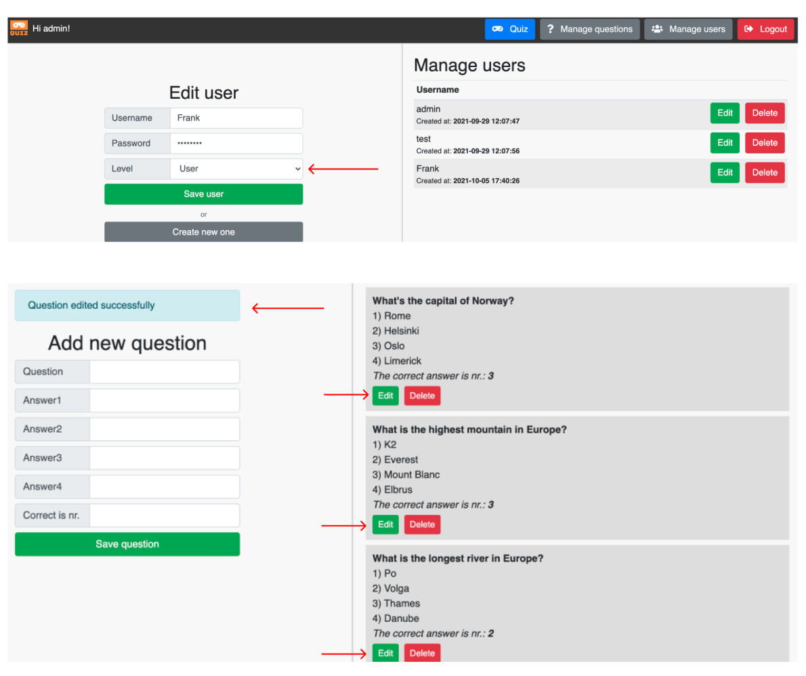
  

 - <strong>Deleting - </strong> The "Deleting" function is present in two parts. The admin can delete any question in the "Manage Questions" section and delete users in the "Manage Users" section. 
 Before deleting any user or question the Admin will receive a warning message advising him of the action. This way the admin will not cancel anything or anyone accidentally. As ad defensive action too, the delete button will change colour when the cursor is over it; it will activate the `Hover` function so that the admin knows exactly which button he/she is about to click.
   

Evidence

    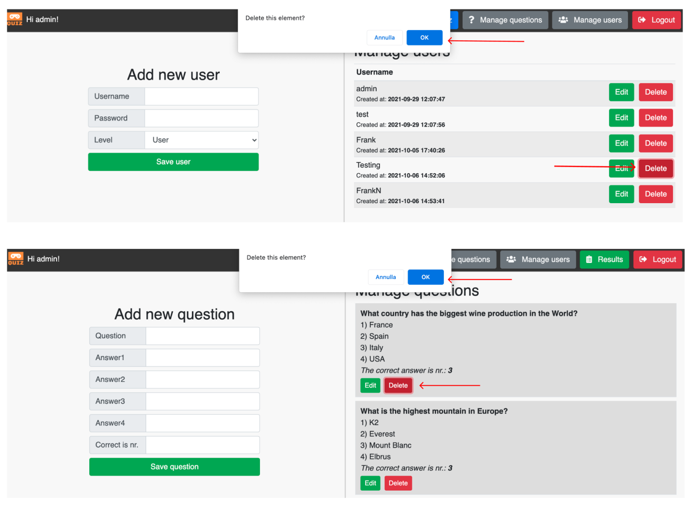
  

 

### Other Features

 - <strong>Already existing username - </strong> If the username already exists, the user is advised.
   

Evidence

    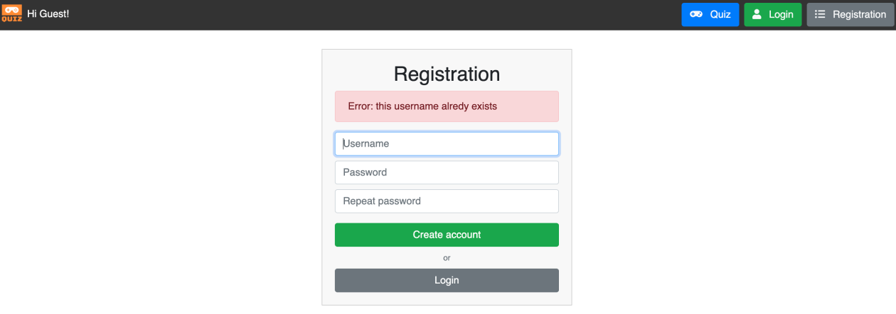
  

 - <strong>Welcome message - </strong> The registered user can see his name on the page.
   

Evidence

    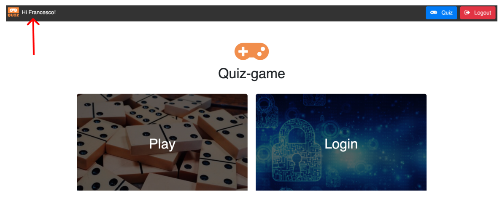
  

 - <strong>Hover effect - </strong> Both the admin and any user always trigger a hover effect that helps with clicling onto the right button.
   

Evidence

    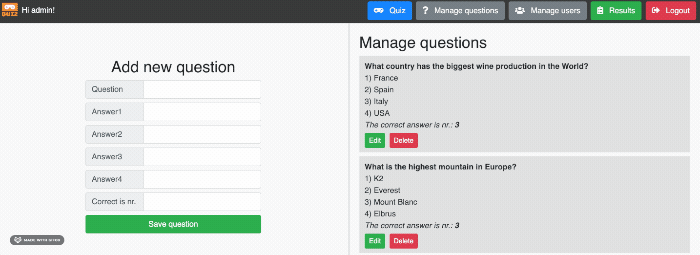
  

***